# Pipeline AI Asset Factory — Luồng Cập Nhật (v3)

## Sơ đồ tổng thể

```mermaid
flowchart TD
    USER(["Người dùng / Cron 00:00 hàng đêm"])

    USER -->|"POST /automation/trigger"| PIPE

    subgraph PIPE["AutomationService — Pipeline chính"]
        P1["Step 1 — Market Discovery"]
        P2["Step 2 — Lọc topic score >= 75"]
        P3["Step 3 — Research Engine"]
        P4["Step 4 — NotebookLM"]
        P5["Step 5 — Slide Parser"]
        P6["Step 6 — Figma Automation"]
        P7["Step 7 — Quality Check"]
        P1-->P2-->P3-->P4-->P5-->P6-->P7
    end

    subgraph MKT["Step 1 — Market Module"]
        GDELT["GDELT API\nTin tuc the gioi"]
        SCORE["Cham diem keyword\ntrendScore · marketScore\ncompetitionScore"]
        DB_T[("DB: MarketTopic\nstatus=DISCOVERED")]
        GDELT-->SCORE-->DB_T
    end

    subgraph RES["Step 3 — Research Module"]
        GEMINI_R["Gemini Flash API\nSinh noi dung Markdown"]
        MD["research_report.md\nOverview · Concepts\nTrends · Examples"]
        GEMINI_R-->MD
    end

    subgraph NLM["Step 4 — NotebookLM Automation"]
        BQ["BullMQ Job\nnotebooklm-worker"]
        PW_NLM["Playwright\n+ session.json"]
        GOOGLE["Google NotebookLM"]
        PPTX["Tai file .pptx"]
        BQ-->PW_NLM-->GOOGLE-->PPTX
    end

    subgraph SLD["Step 5 — Slide Parser"]
        RENDER["node-pptx-png\nSkia-Canvas"]
        PNGS["slide_01.png\nslide_02.png\n..."]
        RENDER-->PNGS
    end

    subgraph FIGMA["Step 6 — Figma Automation"]
        direction TB

        GL["GenLogin Desktop\nProfile da dang nhap Figma Pro\nFingerprint gia lap"]
        CDP["CDP :9222"]
        GL-->CDP

        PW_F["Playwright\nconnectOverCDP"]
        CDP-->PW_F

        subgraph FLOOP["Vong lap moi slide"]
            direction TB
            FA["Tao Section trong Figma\n'Topic Title [2026-08-12]'"]
            FB["Dat slide PNG vao section\nlayer: slide_01_asset"]
            FC["Chon layer → Edit Image\n→ Remove Background\nFigma AI xu ly truc tiep ~3-5s"]
            FD["Export layer\n→ PNG trong suot\nLuu vao disk local"]
            FA-->FB-->FC-->FD
        end

        PW_F-->FLOOP

        FIGMA_FILE["Figma Working File\nLuu tru vinh vien\nchi chua asset da tach nen"]
        FD-->FIGMA_FILE
    end

    subgraph QC["Step 7 — Quality Check"]
        GEMINI_V["Gemini Flash Vision\nPhan tich anh"]
        CHK["Kiem tra:\nNen trong suot\nKhong watermark\nKhong chu noi\nKhong bi cat\nKhong mo"]
        GATE{"Score >= 90?"}
        GEMINI_V-->CHK-->GATE
    end

    subgraph OUT["Ket qua cuoi cung"]
        PASS["COMPLETED\nAsset PNG chat luong cao"]
        FAIL["REJECTED\nGhi log ly do"]
        DB_A[("DB: Asset\nurl · score · metadata")]
        PASS-->DB_A
    end

    P1-.->MKT
    DB_T-.->P2
    P3-.->RES
    MD-.->P4
    P4-.->NLM
    PPTX-.->P5
    P5-.->SLD
    PNGS-.->P6
    P6-.->FIGMA
    FD-.->P7
    P7-.->QC
    GATE-->|"Dat"|PASS
    GATE-->|"Khong dat"|FAIL
```



---

## Cấu trúc Figma File sau khi pipeline chạy

```
📁 AI Asset Library (Figma Working File)
│
├── 📦 Section: "Sustainable Packaging - Minimalist [2026-08-12]"
│   ├── ✨  slide_01_asset      ←  đã tách nền (Figma AI) — KHÔNG có slide gốc
│   └── ✨  slide_02_asset
│
├── 📦 Section: "Electric Vehicles - 3D Isometric [2026-08-12]"
│   └── ✨  slide_01_asset
│
└── 📦 Section: "Mental Health - Minimalist [2026-08-13]"
    └── ...
```

> Không còn slide gốc trong Figma. Mỗi layer là asset đã tách nền hoàn toàn.

---

## Stack công nghệ Zero-Cost

| Bước | Công cụ | Chi phí |
|---|---|---|
| Market Discovery | GDELT API | $0 |
| Research Report | Gemini Flash API | $0 (free tier) |
| NotebookLM | Google account + Playwright | $0 |
| Slide Parser | node-pptx-png (MIT) | $0 |
| Asset Extraction | GenLogin + Figma Pro AI | $0 (đã có Figma Pro) |
| Quality Check | Gemini Flash Vision API | $0 (free tier) |
| **Tổng** | | **$0** |

---

## Trạng thái phát triển

| Sprint | Tính năng | Trạng thái |
|---|---|---|
| 1 | Skeleton project | Hoàn thành |
| 2 | Market Module (GDELT) | Hoàn thành |
| 3 | Research Engine | Hoàn thành |
| 4 | NotebookLM Automation | Hoàn thành |
| 5 | Slide Parser | Hoàn thành |
| 6 | **Figma + GenLogin Automation** | **Đang thiết kế** |
| 7 | Quality Check (Gemini Vision) | Đang phát triển |
| 8 | Admin Dashboard | Đang phát triển |
| 9 | Asset Recipe Engine | Chưa bắt đầu |
